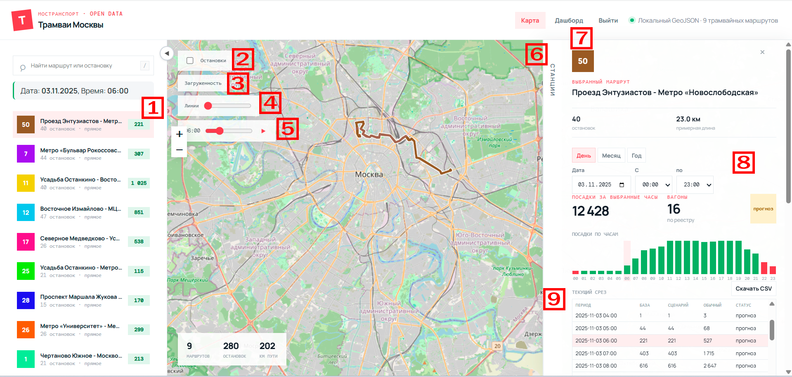
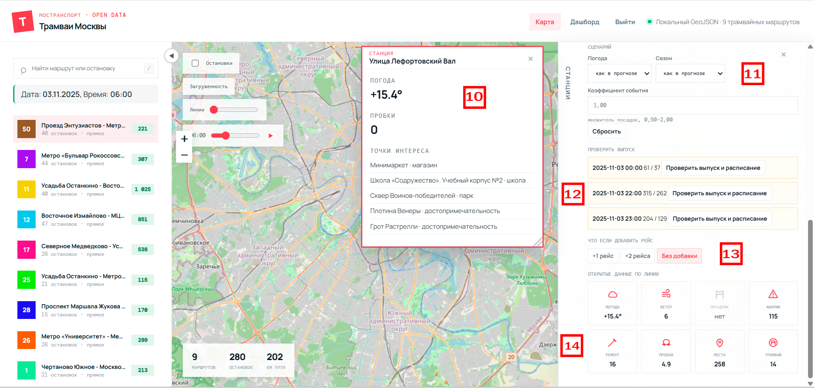

# Трамваи Москвы

Интерактивная карта трамвайной сети Москвы и прогноз почасового числа посадок.

## Финальная модель прогноза

**Результат на скрытом тесте:** **0,88228**. Итоговый файл `final_model/submission_selective.csv` содержит **14 640** прогнозов для 10 маршрутов на ноябрь–декабрь 2025 года. Здесь приведён именно конкурсный результат, без пересчёта в другую метрику.

**Данные.** Целевая величина — число успешных валидаций (`validation_result == 1`) за час и маршрут. Пайплайн обучается на почасовой истории января–октября 2025 года; использует `route`, `date`, `hour`, `boardings` из агрегированных CSV в `data/kaggle_mstrans/`.

**Признаки.** Часовые, недельные и годовые циклы (включая Fourier-признаки); день недели, месяц, выходной, праздник, предпраздничный день и рабочие выходные; исторические профили посадок по `маршрут × час × день недели`, `маршрут × час × тип дня` и `маршрут × час`.

**Ансамбль.** LightGBM (MAE/L1, 536 деревьев) формирует календарный прогноз, SARIMAX добавляет сезонную недельную компоненту (вес 30%). Chronos-2 прогнозирует дневной объём (квантиль 0,7; вес 20%), который распределяется по часам. CatBoost применяется выборочно к маршрутам 11, 12, 25 и 28 с весами 0,35 / 0,10 / 0,35 / 0,45. Для маршрута 5, у которого нет пригодной истории, используется отдельный сценарий, сохранённый в конфигурации.

Код пайплайна, фиксированная конфигурация и зависимости включены в репозиторий. Chronos-2 загружает предобученные веса при первом запуске; модели LightGBM, SARIMAX и CatBoost обучаются из локальных данных.

```bash
python3 -m pip install -r final_model/requirements.txt
python3 final_model/final.py --year 2025
```

Другие исследовательские материалы хранятся отдельно в `experiments/`.

| | |
|---|---|
| **Веб-приложение** | [mostransport-final.vercel.app](https://mostransport-final.vercel.app/) |
| **Финальная модель** | [`final_model/`](https://github.com/KirillVorotnikov/mstrans_model) — отдельный репозиторий |
| **Данные маршрутов** | [Набор 3221 на data.mos.ru](https://data.mos.ru/opendata/3221) |

## Функционал

1. Выбор маршрута для детализированной информации. Число пассажиропотока на указанную выше дату по каждому маршруту.
2. Отключение отображения остановок на карте.
3. Показ загруженности по маршрутам на карте.
4. Толщина отрисовки линий маршрутов на карте.
5. Возможность запуска 24-часового таймлайна для просмотра загруженности маршрутов в динамике.
6. Окно детализированной информации по каждой станции. Для закрытия нажмите на «Станция».
7. Детализированная информация без карты по маршрутам (в доработке).
8. Возможность расчёта пассажиропотока на необходимом интервале времени.
9. График и таблица расчёта (возможность экспорта в CSV).
   - **База** — прогноз.
   - **Сценарий** — с учётом дополнительных IF (ухудшение погоды, добавление рейса).
   - **Обычный** — усреднённое значение.
10. Детализированная информация об остановке: места притяжения, погода.
11. Сценарный конструктор — изменение прогноза погоды и веса пассажиропотока.
12. Сверка выпусков с расписанием.
13. Сценарный конструктор — изменение количества рейсов.
14. Дополнительная информация по дате и маршруту.





## Структура

```text
.
├── index.html, dashboard.html, login.html  # страницы приложения
├── app.js, forecast.js, demand.js, facts.js, dashboard.js
├── styles.css, server.py                   # стили и локальный сервер
├── scripts/                                # утилиты загрузки и обогащения данных
├── data/                                   # данные приложения и входные датасеты
├── assets/                                 # изображения README
├── final_model/                            # финальная модель (отдельный GitHub-репозиторий)
│   ├── final.py                            # полный пайплайн
│   ├── model_config.json                   # зафиксированная конфигурация
│   ├── requirements.txt
│   └── submission_selective.csv             # итоговый прогноз
├── experiments/
│   ├── notebooks/, scripts/                # дополнительные исследования
│   └── results/                             # результаты экспериментов
├── generate_forecast.py                    # генератор CSV-прогнозов
├── Dockerfile
└── docker-compose.yml
```

Исходные и обогащённые датасеты находятся в `data/`.

## Запуск приложения

Нужен Python 3.12+ и локальный HTTP-сервер — браузер блокирует `fetch` из `file://`.

```bash
python3 server.py
```

Откройте <http://localhost:8765>. Локальная учётная запись по умолчанию: `test` / `test`; не используйте эти данные для публичного развёртывания.

Для Docker:

```bash
docker compose up --build
```

## Данные и API

Приложение загружает GeoJSON-функции набора 3221 через:

```text
https://apidata.mos.ru/v1/datasets/3221/features
```

Если API отвечает `401` или `403`, укажите ключ data.mos.ru в поле API-ключа. Он хранится только в текущем браузере. Если API недоступно, интерфейс сообщает о переходе на демо-геометрию; демо-данные не являются официальной выгрузкой.

Локальный `moscow-tram-gtfs.zip` можно открыть из интерфейса. Преобразование маршрутов из GeoJSON использует геометрию как форму трассы. Если расписание отсутствует, времена в экспортируемом `stop_times.txt` синтезируются с шагом 5 минут — такой GTFS требует проверки и дополнения официальным расписанием.

### Загрузка маршрутов

Скрипт использует стандартную библиотеку Python и сохраняет GeoJSON и CSV в `data/`.

```powershell
$env:MOS_API_KEY = "ВАШ_API_КЛЮЧ"
py .\scripts\download_tram_routes.py
py .\scripts\download_tram_routes.py --output .\data\trams.geojson --timeout 90
Remove-Item Env:\MOS_API_KEY
```

## Ограничения

- Остановочные координаты и трассы зависят от полноты открытых источников.
- Сценарные эффекты погоды и событий — оценки по историческим данным, а не гарантированная причинная оценка.
- Результат временной проверки не гарантирует такую же точность на будущем периоде.
